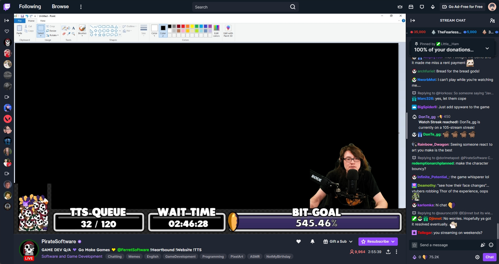
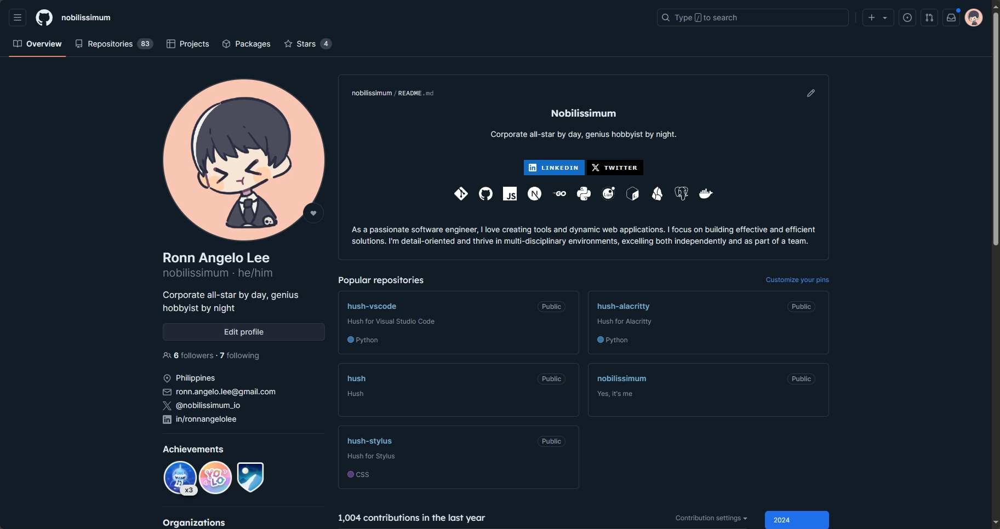

<p align="center">
  
</p>

<h3 align="center">Hush for <a href="https://chromewebstore.google.com/detail/stylus/clngdbkpkpeebahjckkjfobafhncgmne" target="_blank">Stylus</a></h3>

<p align="center">A color theme for clarity and comfort.</p>

<p align="center">
  <a href="https://github.com/nobilissimum/hush-stylus/stargazers">
    
  </a>
  <a href="https://github.com/nobilissimum/hush-stylus/releases">
    
  </a>
</p>


_https://www.twitch.tv/piratesoftware_

<br />


_https://www.github.com/nobilissimum_

## How to apply theme?

Download and install browser extension **Stylus**.

- <a href="https://chromewebstore.google.com/detail/stylus/clngdbkpkpeebahjckkjfobafhncgmne" target="_blank">Stylus for Chrome</a>
- <a href="https://addons.mozilla.org/en-US/firefox/addon/styl-us" target="_blank">Stylus for Firefox</a>

Clone the repository or download the `hush.css` file.

```sh
git clone https://github.com/nobilissimum/hush-stylus
```

Click the **Stylus** extension in the browser's extensions panel then select <kbd>Manage</kbd>. There's a <kbd>Write new style</kbd> option in the side menu under the **Backup** section. This will create a new blank style. Select the <kbd>Import</kbd> button in the side menu then paste the contents of `hush.css` then click <kbd>Overwrite style</kbd>.

## Supported websites

- https://www.github.com
- https://www.linkedin.com
- https://www.twitch.tv
- https://twitter.com and https://x.com
